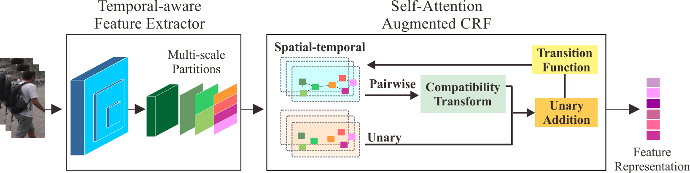
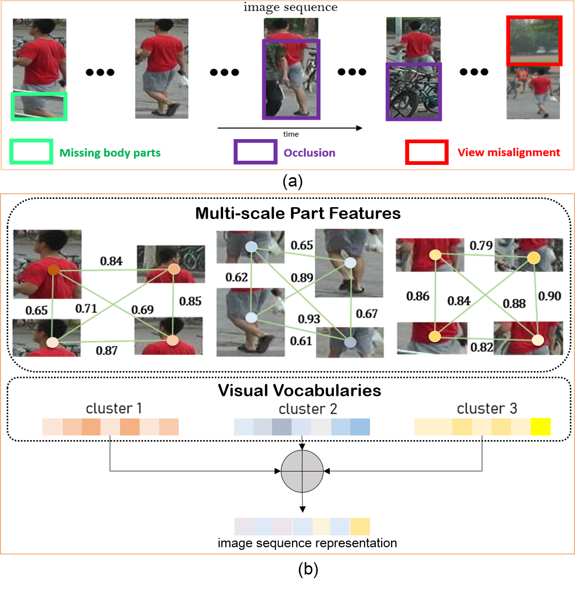

# Learning Spatial-Temporal Graphs with Self-Attention Augmented Conditional Random Fields for Video-Based Person Re-identification

<!--  -->
<!--  -->

This repo is the pytorch implementation of ["Learning Spatial-Temporal Graphs with Self-Attention Augmented Conditional Random Fields for Video-Based Person Re-identification"]().

## Citation

Please consider citing the works below:

```bib
@inproceedings{pramono2019hierarchical,
    title={Hierarchical self-attention network for action localization in videos},
    author={Pramono, Rizard Renanda Adhi and Chen, Yie-Tarng and Fang, Wen-Hsien},
    booktitle={Proceedings of the IEEE International Conference on Computer Vision},
    pages={61--70},
    year={2019}
}

@ARTICLE{9349142,
    author={R. R. A. {Pramono} and Y. -T. {Chen} and W. -H. {Fang}},
    journal={IEEE Transactions on Multimedia}, 
    title={Spatial-Temporal Action Localization with Hierarchical Self-Attention}, 
    year={2021},
    volume={},
    number={},
    pages={1-1},
    doi={10.1109/TMM.2021.3056892}}
    
@inproceedings{pramono2020empowering,
    title={Empowering Relational Network by Self-attention Augmented Conditional Random Fields for Group Activity Recognition},
    author={Pramono, Rizard Renanda Adhi and Chen, Yie Tarng and Fang, Wen Hsien},
    booktitle={Proceedings of the European Conference on Computer Vision},
    pages={71--90},
    year={2020}
}
```

## Usage

### Pretrained Model
- Pre-trained model for feature extraction and the graph network will be uploaded soon

### Requirements
- `Ubuntu 20.04`
- `Anaconda3` with `python=3.6`
- `Pytorch=1.10.2`
- `wandb=0.12.14`

#### Notes
- We use [wandb](https://wandb.ai/) for visualization, if you don't want to use it, just set the wandb_flag in to False in the train_[Dataset].py
